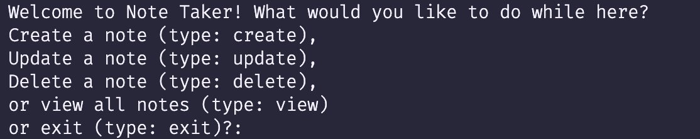

# Python CLI Project
> This project is a note-taking app that can be interacted with in the terminal. This performs full CRUD with a database in SQL.

---
## How to Use:
1. Begin by forking and cloning this repository. 
2. Install the dependencies by typing the following into your terminal:

```
pipenv install
```
3. Run the enviroment (pipenv) so that you can then run the file. Type the following into your terminal:
```
pipenv shell
```

4. Run the main.py file by typing the following into your terminal:

```
python3 main.py
```
5. Follow the prompt in the terminal! It will inform on how you can interface with the app. You can see an example of the instructions below:



---

## What this app can do:
This application is capable of full CRUD functionality with an SQL database. 

- C. (Create): The user is able to create a note and its contents.
- R. (Read): The user is able to view all the notes in the collection, and then specifically view the contents of a note.
- U. (Update): The user can update any existing note, changing ether the title or the content. 
- D. (Delete): The user can delete any existing note. 
----
----


### Connect with me:
Feel free to connect with me on [LinkedIn](https://www.linkedin.com/in/justin-sotolongo/)

If you notice any bugs, let me know! I am always open to feedback.